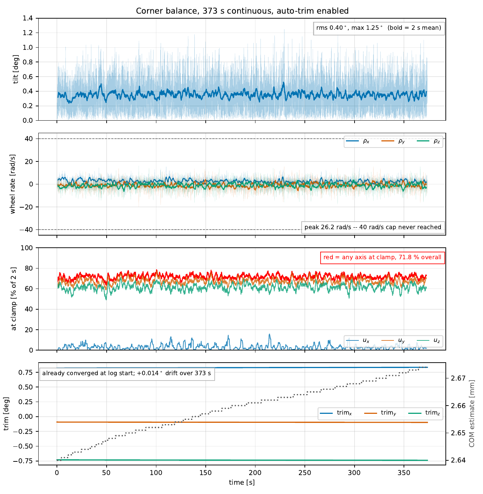
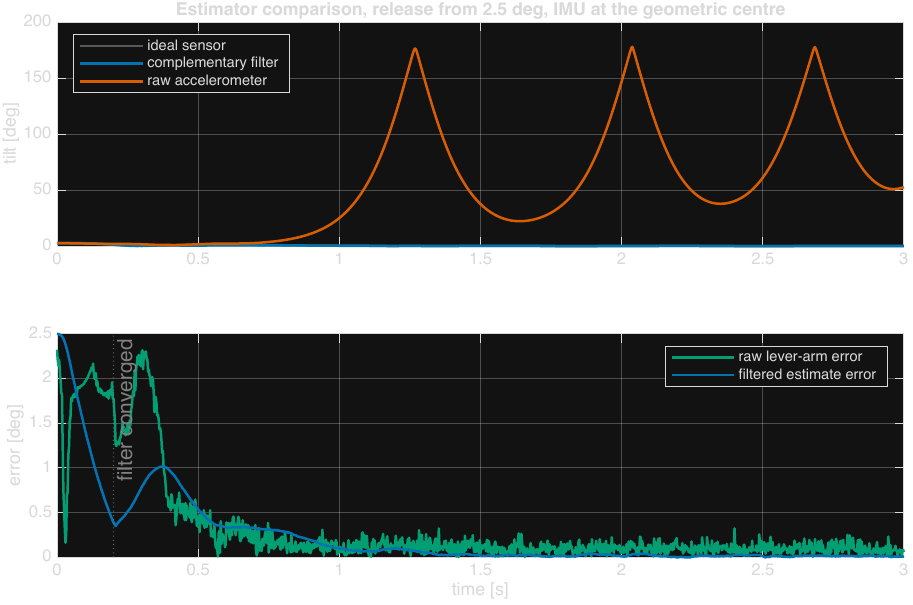
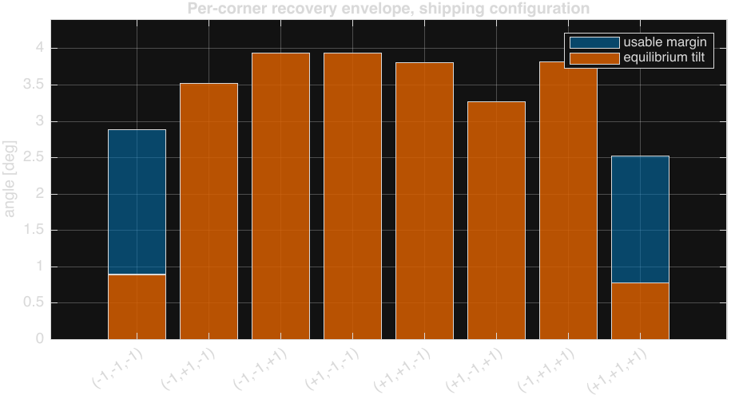

# Cubli — Space Challenge 2026

A 156 mm reaction-wheel cube that balances on an **edge** and on a **corner**,
taken from Lagrangian derivation through Simscape multibody simulation to
working hardware — and validated against its own flight telemetry.



*373 seconds of continuous corner balance. Tilt RMS 0.40°, peak 1.25°, wheels
never reaching the 40 rad/s policy cap. Raw log:
[`data/corner/corner-balance-373s-2026-08-20.log`](data/corner/corner-balance-373s-2026-08-20.log).*

---

## What it achieves

| | Result | Source |
|---|---|---|
| **Corner balance, longest run** | **373.5 s continuous**, tilt RMS **0.40°**, max 1.25° | [log](data/corner/corner-balance-373s-2026-08-20.log) |
| **Corner balance, quietest run** | 278 s, tilt RMS **0.25°**, max 0.92° | [log](data/corner/FINAL_CALIBRATION.log) |
| **Edge balance** | **197 s continuous**, tilt RMS 0.58° | [log](data/edge/1minEDGE.log) · [report](docs/testing/Corner-RateFilter-and-Edge-Hardware-Tests-2026-08-19.md#4-edge--1-min-quiet-hold) |
| **Disturbance rejection** | recovers ~3° pushes in **0.08–0.20 s**; trips at the 25° policy limit | [report §3](docs/testing/Corner-RateFilter-and-Edge-Hardware-Tests-2026-08-19.md#3-pushes--how-hard-until-it-falls) |
| **Edge release** | recovers from **6.18°**, settles under 0.5° by 9.6 s | [report §5](docs/testing/Corner-RateFilter-and-Edge-Hardware-Tests-2026-08-19.md#5-edge--recovery-from-6) |
| **Predicted envelope** | 2.76°–3.14° worst-case recovery, all 8 corners | [envelope study](docs/dynamics/Cube-Performance-Envelope-Results.md#per-corner-results-own-gains-supersedes-part-2-3s-table) |

The hardware sits inside the envelope the simulation predicted, and the run above
is *momentum*-bound rather than torque-bound — exactly the binding constraint the
model identified before the cube was ever switched on.

## The system

| | |
|---|---|
| **Structure** | 156 mm printed PETG-CF frame, 1.615 kg assembled, 3 ballasted reaction wheels |
| **Actuation** | 3 × T-Motor Antigravity 4006 (Kt 0.02513 N·m/A) on 3 × [mjbots moteus-n1](https://mjbots.com) FOC drivers, 5 Mbps CAN-FD |
| **Sensing** | Bosch BMI270 IMU at the cube's geometric centre — 130 mm from *every* corner |
| **Compute** | Teensy 4.1 running the 400 Hz control loop; XIAO ESP32-C6 as a Wi-Fi telemetry bridge |
| **Estimator** | reduced-attitude complementary filter with gyro-bias states (`kP = 4`, `kI = 0.5`) |
| **Control** | per-corner and per-edge reduced-order LQR, yaw-projected — 8 corner gain sets, 12 edge gain sets |
| **Operating point** | τ_max 0.12 N·m, wheel-speed cap 40 rad/s (firmware policy, not a hardware limit) |

## The engineering story

**1 — Derive the plant.** The [3D Lagrangian derivation](docs/dynamics/3D-Cubli-Lagrangian-Derivation.md)
is worked from scratch and specialised to the 1D/2D edge case, with
[CAD → model parameters](docs/dynamics/Deriving-Dynamics-from-CAD.md) and an
[attitude-representation study](docs/dynamics/Quaternions-Complete-Guide.md)
that ends up rejecting quaternions for corner balance and choosing a reduced
attitude instead — [argued, not assumed](docs/dynamics/Attitude-Representation-for-Firmware.md).

**2 — Prove it on a 2D panel first.** A [Simscape panel model](docs/simulation/Simscape-Panel-Model-Build-Guide.md)
with four dedicated nonlinearity studies — [saturation envelope](docs/simulation/reports/Saturation-Envelope-Test-Block-A.md),
[discrete-loop delay](docs/simulation/reports/Discrete-Loop-Test-Block-B.md),
[IMU lever arm](docs/simulation/reports/IMU-Lever-Arm-Estimator-Block-C.md),
[friction sensitivity](docs/simulation/reports/Friction-Sensitivity-Block-D.md).
The [1D-jig-to-3D-cube strategy](docs/dynamics/1D-Jig-to-3D-Cube-Strategy.md)
states exactly what transfers and what does not.

**3 — Build the cube model three ways.** A 9-state linear design plant, a
Simscape multibody model built from imported STEP geometry, and a fast nonlinear
plant with sensors and actuator limits. They agree to
[`A err 1.7e-07`](docs/dynamics/Cube-Performance-Envelope-Results.md#validation-chain)
and within 1 % through the transient — which is what makes the thousands of
bisection runs behind the recovery envelope trustworthy.

<table>
<tr>
<td width="50%"></td>
<td width="50%"></td>
</tr>
<tr>
<td><b>The accelerometer lever arm is the dominant sensing effect.</b> Fed raw, the
cube falls every time, at any IMU position. The complementary filter rejects it
almost entirely — but there is a cliff past ~150 mm, which is why the IMU sits at
the geometric centre.</td>
<td><b>All eight corners balance, but each needs its own gains.</b> Apply the
primary corner's gains elsewhere and six corners diverge at the open-loop rate.
The antipodal corner <i>almost</i> works — a 13 s fall that short tests score as
a pass.</td>
</tr>
</table>

**4 — Find the real limits, then design to them.** A 48-point Bryson grid moves
the envelope by 2 %; the [actuator chart](figures/simulation/png/actuator_chart.png)
moves it by 4×. The conclusion — *the envelope is set by hardware, not by the
controller* — is what makes the rest of the project honest about what tuning can
and cannot buy. The shipped weights are chosen on
[robustness to inertia error](figures/simulation/png/qw_robustness.png), not on
peak performance: `qw = 10` costs 4 % against the grid optimum and is the only
set that survives ±20 % on Θ.

**5 — Climb a staged bring-up ladder on hardware.** Every control mode is reached
through the same five stages, each of which must pass before the next is flashed:
open-loop torque → damping only → position + damping → full law → release. The
ladders live in [`firmware/`](firmware/) — [panel](firmware/panel-bringup/),
[cube](firmware/cube-bringup/), [edge](firmware/edge-bringup/),
[corner](firmware/corner-bringup/), and a separate [Wi-Fi link ladder](firmware/link-bringup/).

**6 — Measure, and correct the record when it disagrees.** The
[hardware test reports](docs/testing/) are written to be falsifiable: the
rate-filter A/B is reported as **not a clean comparison** and the reasons are
given; a firmware comment claiming "20–30 dB of attenuation" is shown to be
**~6 dB** with the filter theory to prove a first-order filter cannot do better.
Simulation values that later proved wrong are struck through and corrected in
place rather than quietly edited.

## Repository map

```
├── docs/           theory, design studies and test reports
│   ├── dynamics/       Lagrangian derivation, attitude, CAD→parameters, cube envelope
│   ├── simulation/     panel model build guide + 4 nonlinearity studies + cube envelope
│   ├── testing/        hardware test campaigns, fine-tuning plan
│   ├── electronics/    electrical design guide + schematic PDFs
│   ├── bom/            component reference, motor notes, CAD↔BOM handoff
│   └── references/     literature, with DOIs
├── simulation/     MATLAB + Simulink/Simscape
│   ├── panel-2d/       the 1D/2D panel model and its LQR design
│   ├── cube-3d/        the 3D cube: params, plant, nonlinear sim, Simscape, studies, CAD
│   └── validation/     tools that plot hardware telemetry against the model
├── firmware/       Teensy + XIAO, organised as bring-up ladders
│   ├── panel-bringup/  cube-bringup/  edge-bringup/  corner-bringup/  link-bringup/
│   ├── cubli-ui/       the consolidated final system: firmware, dashboard, tools
│   ├── imu-calibration/  xiao/
│   └── archive/        superseded builds, kept for provenance
├── data/           curated flight telemetry (see data/README.md for formats)
├── figures/        every plot, render and demo video
└── hardware/       KiCad schematic, PCB and project libraries
```

## Reproducing the results

**Simulation** needs MATLAB with Simulink, Simscape and Simscape Multibody, plus
the Control System Toolbox. See [`simulation/README.md`](simulation/README.md)
for the exact run order — several scripts depend on workspace state left by
earlier ones and will tell you so if you skip ahead.

```matlab
addpath(genpath('simulation'))
cubli_demo          % self-contained 3D recovery demo — no Simulink needed
```

**Firmware** is Arduino-IDE / `arduino-cli` sketches for Teensy 4.1 and XIAO
ESP32-C6. Start at [`firmware/README.md`](firmware/README.md); to actually run
the cube, [`firmware/cubli-ui/README.md`](firmware/cubli-ui/README.md) is
self-contained.

## Who did what

This was a two-person build for the Space Challenge Sofia 2026 programme, and the
repository contains both people's work.

**Niccolò Tonetto** — dynamics and all written analysis ([`docs/`](docs/) is
entirely mine): the Lagrangian derivation, attitude-representation study,
CAD-to-parameters method, the 2D panel Simscape model and its four nonlinearity
studies, the 3D cube simulation chain (per-corner plant, reduced-order LQR,
nonlinear sim, recovery-envelope sweeps, figure generation), the electronics —
[schematic, PCB and BOM](hardware/) — and the five-stage bring-up ladder used for
every control mode.

**Pablo Urioste** ([@pablourioste](https://github.com/pablourioste)) — the
telemetry and Wi-Fi stack and the tooling around it: the XIAO bridge, the
[`cubli-ui`](firmware/cubli-ui/) dashboard and analysis tools, the Wi-Fi variants
of the bring-up stages, and IMU calibration.

The `git log` is the authoritative record; `git shortlog -sn` gives the split.

## Status and honest limits

This is a working balance controller, not a finished vehicle. Known gaps, all
documented rather than hidden:

- **Only corner `[-1,-1,-1]` has been flown.** All eight corners are
  geometry-complete and have verified gain designs, but the `Kp` matrices for
  corners 2–8 have not been transcribed into firmware — and running a corner on
  the wrong corner's gains is [worse than not identifying it at all](docs/dynamics/Cube-Performance-Envelope-Results.md#whats-not-re-derived-yet).
- **Multi-corner locomotion is currently off the table on six of eight corners.**
  A structural strut added during bring-up shifted the COM enough that their
  equilibrium tilt now exceeds their own recovery envelope. The analysis is
  [in the repo](docs/dynamics/Cube-Performance-Envelope-Results.md#multi-corner-picture--the-finding-that-matters); the fix is a counterweight, not a gain change.
- **No jump-up.** Balance only — the braking jump-up of the ETH papers was not attempted.
- **Edge balance has no simulation study.** It went straight from estimator design
  to staged hardware bring-up, so its numbers are measured, not predicted, and the
  reports say so.
- **Several plant parameters are still estimates** — wheel Coulomb friction, viscous
  damping and the real continuous-torque limit are flagged `PLACEHOLDER` in
  [`cubli_gains.h`](firmware/cubli-ui/teensy/cubli_gains.h) pending spin-down and
  thermal tests.
- **The wheel-speed cap costs about 20 % of available capability.** Raising it
  requires balanced wheels and a re-run of the gain grid, in that order — it is
  not a constant you can edit.

## References

Full citations with DOIs in [`docs/references/`](docs/references/README.md). The
core prior art is the ETH Zurich Cubli — Gajamohan et al. (IROS 2012, ECC 2013)
and Muehlebach & D'Andrea (IEEE TCST 2017).

## License

Original work in this repository is MIT licensed — see [LICENSE](LICENSE).
Third-party vendor libraries, JavaScript and fonts keep their own licenses —
see [NOTICE](NOTICE).
