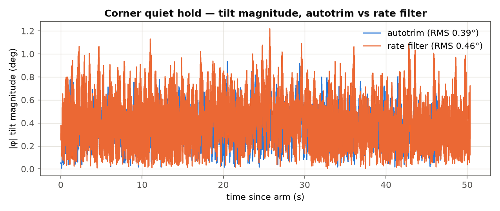
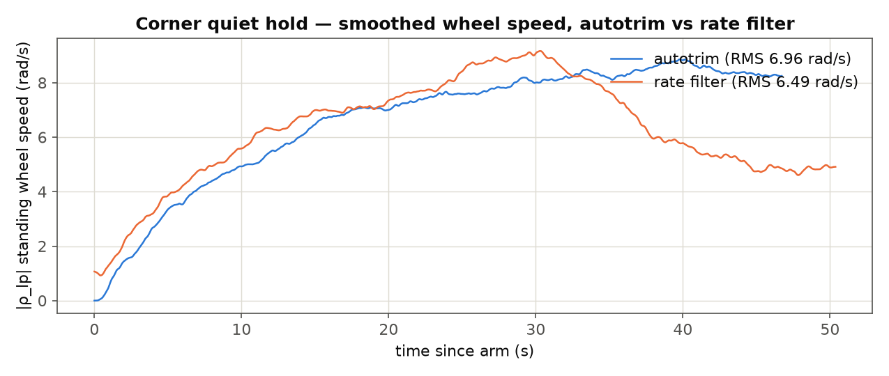
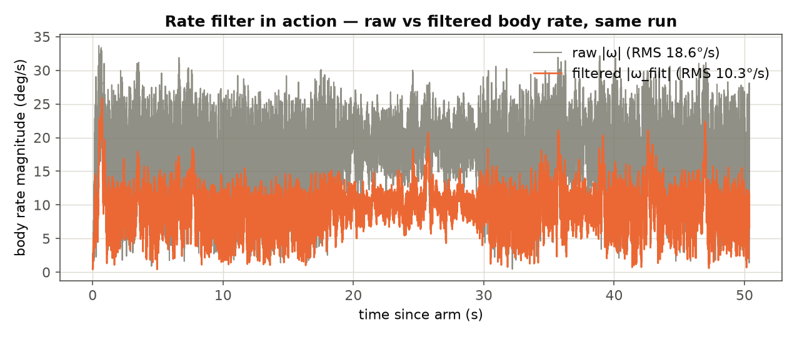
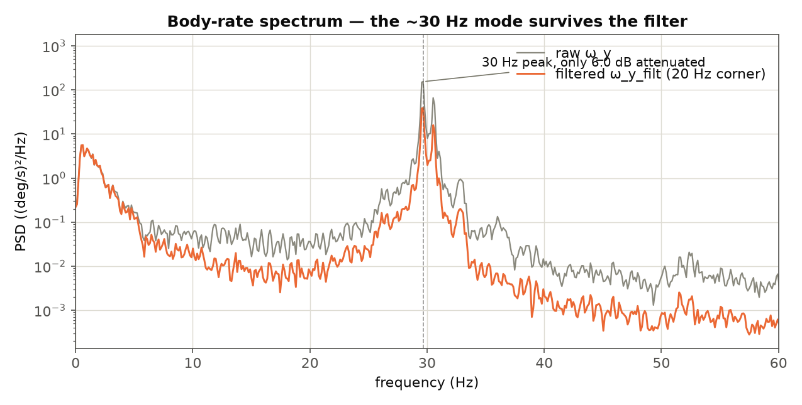
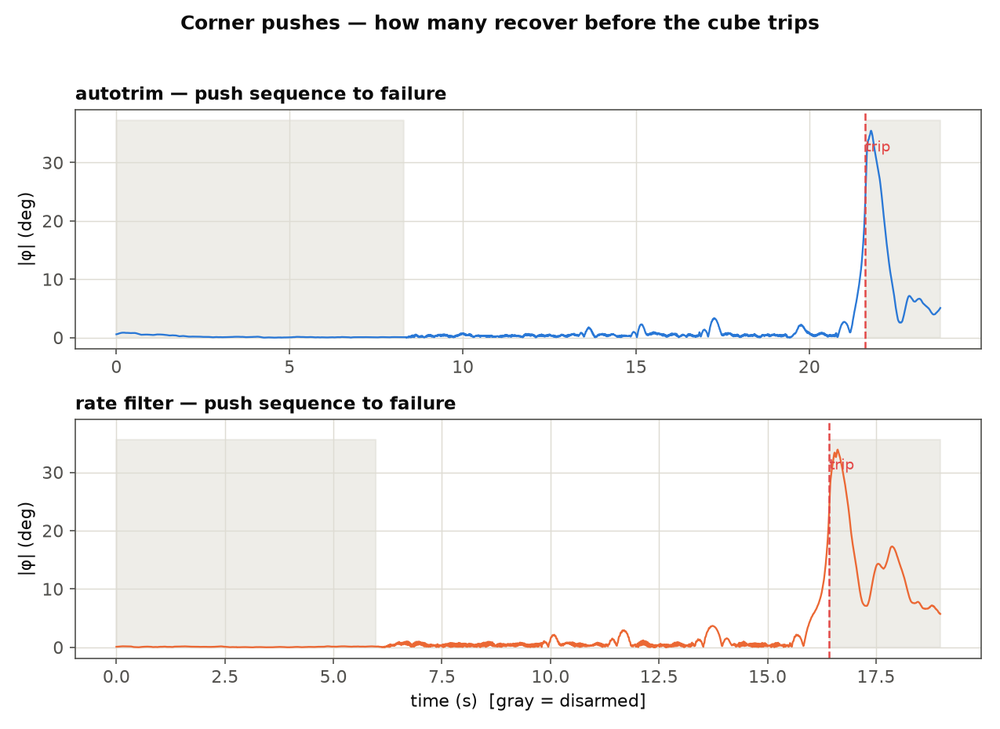
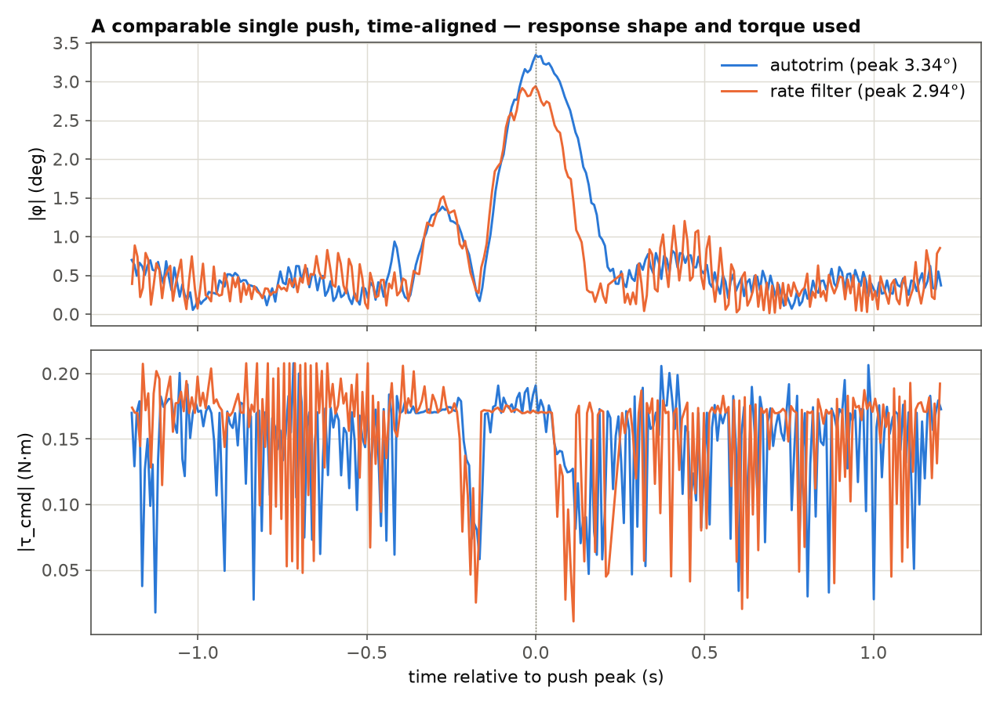
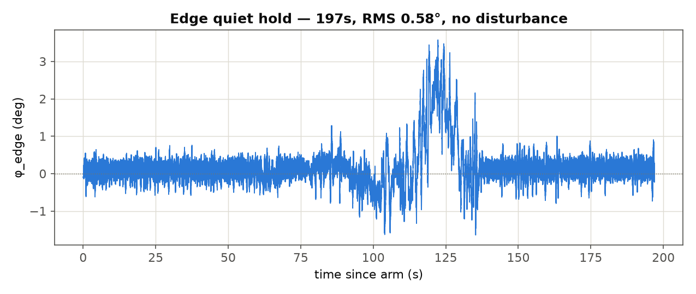
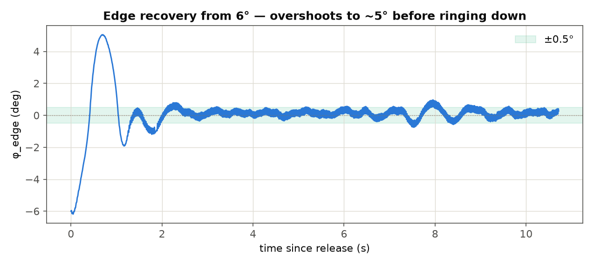

---
tags:
  - space-challenge
  - sofia
  - cubli
  - cube
  - hardware
  - testing
  - corner
  - edge
  - rate-filter
---

# Corner Rate-Filter & Edge Hardware Tests — 2026-08-19

Six hardware captures processed from `firmware/3D model/Gam/FINAL/telemetry/serial/`:
four corner-balance runs (comparing `Stage4_AutoTrim.ino` against
`Stage4_AutoTrim_RateFilter.ino` — see
[`../dynamics/Cube-Performance-Envelope-Results.md`](../dynamics/Cube-Performance-Envelope-Results.md)
and `fine-tuning/README.md` for the rate-filter mechanism itself) and two
edge-balance runs (`edge-bringup/Stage4_FullLaw.ino`).

| Label | File | What it is |
|---|---|---|
| `1min_CORNER_autotrim` | `1minCORNER_autotrim.log` | ~1 min quiet corner hold, no rate filter |
| `1min_CORNER_lpf` | `1minCORNER_lpf.log` | ~1 min quiet corner hold, rate filter (20 Hz) |
| `PUSHES_CORNER_autotrim` | `PUSHES_CORNER_autotrim.log` | Repeated pushes to failure, no rate filter |
| `PUSHES_CORNER_lpf` | `PUSHES_CORNER_lpf.log` | Repeated pushes to failure, rate filter |
| `1min_EDGE` | `1minEDGE.log` | ~3 min quiet edge hold (intended: no disturbance) |
| `EDGE6degrees` | `EDGE6degrees.log` | Recovery from a 6° edge release |

All six load and parse cleanly via `plot_session_csv.py`'s `load_rows()` with
no format issues. Every armed window below is the single longest contiguous
`armed==1` stretch in its file (`fft_tilt_analysis.py`'s `armed_crop` logic).

**Headline, before the detail:** the quiet-hold "autotrim vs rate filter"
comparison below is **not a clean A/B** — see §1's caveat — so don't read
its numbers as a verdict on the filter by themselves. The two results that
*are* clean are §2 (the filter only gives ~6 dB at the mode it targets, not
the 20–30 dB the firmware header currently claims — a real error, now
flagged for correction) and §3 (both configurations fail at essentially the
same push severity). §4 and §5 are edge-balance, unrelated to the rate-filter
question.

---

## 1. Corner quiet hold — autotrim vs rate filter



| | autotrim | rate filter |
|---|---|---|
| armed duration | 46.7 s | 50.4 s |
| \|φ\| RMS | 0.39° | 0.46° |
| \|φ\| max | 0.93° | 1.22° |
| \|ρ_lp\| (standing wheel speed) RMS | 6.96 rad/s | 6.49 rad/s |
| torque saturation duty (per axis, frac. time ≥99% τ_max) | 0.21 / 0.45 / 0.41 | 0.26 / 0.60 / 0.67 |
| raw \|ω\| RMS | 8.76°/s | 18.57°/s |

Read at face value, this says the rate filter run has **worse** tilt-holding
and **higher** torque saturation than the plain autotrim run — the opposite
of "calmer." Don't take that at face value:

**Confound #1 — these are two different bench sessions, not a toggle
within one.** The lpf run's *raw, pre-filter* `|ω|` RMS (18.6°/s) is more
than double the autotrim run's (8.8°/s). Since `w_b` is the same raw gyro
signal in both firmware variants, that gap can't be the filter's doing —
it means the lpf session's corner was physically noisier (seating,
vibration source, whatever) *before either config touched it*. Every
downstream number in that row (`|φ|` RMS, sat duty) inherits that
baseline difference. This table cannot tell you whether the filter helped
or hurt; it can only tell you the two sessions weren't equally quiet to
start with.

**Confound #2 — `k_a` moved too.** `Stage4_AutoTrim_RateFilter.ino` ships
both the rate filter *and* a faster trim-adaptation gain (`k_a`: 2.922e-6 →
1e-4, i.e. ~60s → ~10s time constant) in the same build. Look at standing
wheel speed over time, not just its RMS:



Both climb together for the first ~30s (trim still walking in from its
seed), but only the rate-filter run visibly turns over and *decays* — from
~9 rad/s at t=30s to ~5 rad/s by t=45s — within this 50s window. That
shape is what a ~10s time constant looks like on this timescale; the
autotrim run's ~60s time constant hasn't gotten anywhere near converging
yet at t=47s. **The "wheels move much less" you felt on the bench may be
mostly `k_a` converging faster, not the rate filter removing noise from
the control law** — two independent changes shipped in the same file, and
this data can't separate them.

**What to test next, to actually separate them:** both are live-settable
(`f<Hz>`, `k<value>`) on the *same* firmware build, so run this in one
sitting instead of comparing across sessions:
1. Rate filter OFF equivalent (`f200` or similar, effectively no filtering) + fast `k_a` (leave at 1e-4)
2. Rate filter ON (`f20`) + slow `k_a` (`k2.922e-6`, the old default)

That isolates which lever is actually responsible for which felt effect,
on hardware that's at least in the same seated/trimmed state within the
session.

---

## 2. What the rate filter actually attenuates



Within the lpf run alone (a clean comparison — same session, same
samples, only the filter differs), `|ω|` RMS drops from 18.6°/s raw to
10.3°/s filtered — a real ~45% reduction, visibly smoothing the trace.

But RMS-over-everything hides where the energy actually is. The PSD tells
a sharper story:



There's a real, sharp mode at **~29.7–30.5 Hz** (all three axes agree, via
Welch PSD, `nperseg=1024` @ ~125 Hz effective sample rate) — this is very
likely the same structural mode `hw-run-analysis.md` diagnosed. At that
frequency, the filter (20 Hz corner, first-order) attenuates it by only
**~6 dB** (measured 5.98–6.3 dB across the three axes) — a factor of ~2,
not the "20–30 dB" `Stage4_AutoTrim_RateFilter.ino`'s and
`Stage5_AutoTrim_RateFilter.ino`'s header comments currently claim.

**That claim is a math error in the design comment, not a measurement
disagreement — the two are structurally incompatible for a first-order
filter:**

```
attenuation(f) = sqrt(1 + (f/fc)^2)        [amplitude, first-order LPF]
```

At `fc=20Hz, f=30Hz`: `sqrt(1+(30/20)^2) = 1.8x ≈ 5.1 dB` (amplitude) /
`~3.2x ≈ 10.2 dB` (power) — matches what's measured. Getting 20–30 dB
*amplitude* attenuation at 30 Hz from a first-order filter needs
`fc ≈ 1–3 Hz`, which would put ~40–60° of phase lag at the 1.3 Hz control
bandwidth — exactly the responsiveness cost the filter was designed to
avoid. **A first-order filter cannot deliver both "negligible lag at
1.3 Hz" and "20–30 dB at 30 Hz" at the same time** — they're less than 5
octaves apart, and a first order only gives 6 dB/octave. The filter *is*
doing something real (the ~45% RMS reduction, the visibly calmer trace),
but it is not killing the mode — it's taking the edge off it. This
firmware comment needs a correction (see "Follow-ups" below); it
overstates the effect.

**What to test next:** if more rejection at ~30 Hz is worth more lag at
1.3 Hz, the honest options are (a) a lower corner frequency and re-measure
the real closed-loop phase margin cost at 1.3 Hz rather than trusting the
theoretical "negligible" estimate, or (b) a steeper filter (2nd-order, or
a narrow notch centered on the measured ~30 Hz peak) that can hit both
targets without conflating them — worth scoping as a real design task,
not a bench sweep, given it changes the filter's structure, not just its
one constant.

---

## 3. Pushes — how hard until it falls



Neither test measured push force directly (no load cell) — what's
measurable is the outcome: peak tilt reached, whether the controller
recovered, and (when it didn't) that it hit `Stage4_AutoTrim.ino`'s
25° tilt trip (`kMaxTilt`), which disarms and lets the cube fall.

| | autotrim | rate filter |
|---|---|---|
| recovered pushes before failure | 5 (1.78°, 2.28°, 3.34°, 2.20°, 2.70° peak) | 4 (2.17°, 2.94°, 3.69°, 2.18° peak) |
| recovery time to <1° per recovered push | 0.09 – 0.20 s | 0.08 – 0.20 s |
| final push — peak tilt before trip | 24.0° | 23.8° |
| post-trip free-fall peak (wheels cut) | 34.6° | 33.4–33.9° |

**Both configurations survive pushes of essentially the same size and
fail at essentially the same severity** (24.0° vs 23.8° right before
hitting the 25° trip — both are really just "hit the trip threshold",
which is identical firmware policy in both configs, not a property of the
rate filter). Recovery times for the successful pushes are also
statistically indistinguishable (0.08–0.20 s range, same in both). **This
test does not show one configuration surviving bigger disturbances than
the other.**

Where a difference does show up is in the shape of a matched-size
recovery:



A ~3° push (autotrim 3.34°, rate filter 2.94° — closest matched pair,
picked so neither is contaminated by the following push) shows the
autotrim response is slightly sharper — faster rise, faster drop back
under 1° — while the rate-filter response has a marginally longer tail
before settling. That's consistent with the ~6 dB / phase-lag trade-off
in §2: some real cost to responsiveness, but a small one, and it doesn't
show up as a lower failure threshold in this data. The torque trace
(bottom panel) is already bouncing against the 0.12 N·m ceiling during
*quiet* hold in both configs, well before either push — the same
saturation signature `hw-run-analysis.md` originally flagged, still
present.

---

## 4. Edge — 1 min quiet hold



RMS 0.58° over the full 196.96s armed window — but **this run wasn't
actually undisturbed**: there's a clear excursion to ~3.5° tilt between
roughly t=100s and t=135s, self-recovering with no armed dropout and no
`#`-comment marker in the raw log to explain it (checked — only the
arm/disarm banner lines are present). Worth knowing about before treating
0.58° as "the" quiet-hold noise number — it's pulled up by that ~35s
window. Outside that window the trace looks like plain sensor/torque
noise around 0°, similar in character to the corner runs above.

---

## 5. Edge — recovery from 6°



Released from -6.18°, this is **not** a fast, clean recovery — it's a
lightly-damped ring-down:

| Milestone | Time |
|---|---|
| Release | t=0, φ=-6.18° |
| Overshoot peak (past zero, other side) | t=0.70s, φ=+5.05° |
| First crosses under 2° (transiently) | t=0.97s |
| First crosses under 1° (transiently) | t=1.89s |
| Settles under 0.5° and never re-exceeds it | t=9.64s |
| Settles under 0.3° and never re-exceeds it | t=10.71s |

A naive "time to first cross a threshold" reads as sub-half-second and is
misleading — the trace keeps ringing (visible bumps back up to ~0.9° as
late as t=8s) for several more seconds after that first crossing. The
overshoot itself is the notable number: from a 6° release, tilt swings to
within 1° of the *same magnitude on the opposite side* before damping
starts winning. Worth a look against the edge control law's own damping
ratio/pole placement — an overshoot this close to 1:1 suggests the
closed-loop poles are lightly damped, not just slow.

---

## Follow-ups this data surfaces

- **Fix the firmware header comment.** Both
  `Stage4_AutoTrim_RateFilter.ino` and `Stage5_AutoTrim_RateFilter.ino`
  claim "20-30 dB of attenuation at 35 Hz" for the rate filter — §2 shows
  the real number is ~6 dB, and why a first-order filter structurally
  cannot do better without conflicting with the "negligible lag at
  1.3 Hz" requirement. This needs correcting so nobody re-derives a false
  sense of margin from it later.
- **Re-run the quiet-hold comparison as a same-session `f`/`k` toggle**
  (§1), not two separate sessions — the current comparison is confounded
  on two independent axes (baseline noise level, `k_a`) and can't actually
  answer "did the filter help."
- **Decide whether more high-frequency rejection is worth pursuing**, and
  if so scope it as a filter-structure change (2nd order / notch), not a
  corner-frequency sweep — §2's math shows the corner-frequency knob alone
  can't hit both targets.
- **The 1minEDGE anomaly (§4)** — worth a repeat run to see if it recurs;
  if it does, it's a real disturbance source that needs identifying before
  the edge-balance quiet-hold number can be trusted as "no disturbance."
- **Edge recovery's overshoot (§5)** is a bigger effect than corner
  balance shows at comparable disturbance sizes — worth a direct
  side-by-side if edge and corner are meant to share tuning philosophy.
