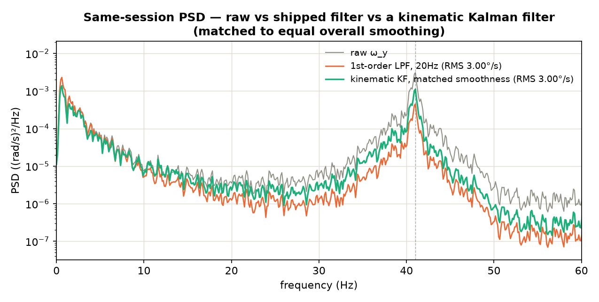

---
tags:
  - space-challenge
  - sofia
  - cubli
  - cube
  - controls
  - estimator
  - filtering
  - kalman
  - analysis
---

# Kalman Filter Rate-Estimator Evaluation — 2026-08-20

Follow-up to `Notch Filter and Adaptive Control — Evaluation.md`'s conclusion:
filtering alone (notch, 1st- or 2nd-order low-pass, even an ideal brick wall)
floors at ~88% of the torque clamp, because ~88% of the rate signal's energy
sits below 5 Hz where signal and noise share the same frequency band and no
frequency-domain filter can separate them. That document names the one
technique that isn't frequency-bound as the way past the floor: **"A linear
Kalman filter on the reduced-attitude state... would reject gyro content that
is not matched by observed attitude motion."** This asks what that actually
takes, and whether it delivers.

**Bottom line up front:** yes, a properly-built Kalman filter can reject noise
a frequency filter structurally cannot, for the same reason the existing
complementary filter already makes `phi` clean while `w_b` stays noisy — it's
model-based, not frequency-based. But "properly built" is doing real work in
that sentence. A naive version (built and tested on real telemetry below)
**loses** to the shipped 1st-order filter on both metrics that matter. The gap
between the naive and the real version is entirely the process model, and
building the real one needs data this repo doesn't currently have.

---

## 1. Why a Kalman filter can beat any frequency filter here, in principle

A frequency filter has exactly one variable to decide "keep or reject":
frequency. If `phi`'s real 1.3 Hz oscillation and broadband gyro noise both
have energy at, say, 3 Hz, a low-pass, high-pass, or notch cannot tell them
apart — they occupy the same axis it discriminates on. That's the literal
content of the Notch doc's §2.2/§3: 34.5% of `omega_y`'s variance is below
5 Hz, and so is a comparable share of the noise, so no filter shaped by
frequency alone can separate them.

A Kalman filter discriminates on a **different** axis: consistency with a
dynamics model. Concretely, if the filter knows `phi_dot = om` (kinematics,
exact) and — in the full version — the corner plant's `om_dot = f(phi, om,
rho, tau)` (the same `A`, `B` already used to derive `Kp`), then at every step
it can compare what the model *predicts* `om` should be against what the
gyro *says* `om` is, and weight the gyro measurement down when it disagrees
in a way inconsistent with real corner dynamics — **including inside the
same frequency band real motion occupies**, which a low-pass physically
cannot do.

This is not a new mechanism in this codebase — it is the existing
complementary filter's own trick, applied to only half the state. `ghat`
already gets this treatment (cross-product feedback between gyro-predicted
and accelerometer-observed gravity direction, `kP=4`/`kI=0.5`, hand-tuned but
structurally a Kalman-family estimator), which is exactly why `phi` comes out
clean. `w_b = wRaw - bhat` gets none of it — it's raw gyro minus a slowly-
adapting bias, full stop. The asymmetry the Notch doc's §3 names ("the
estimator smooths one channel and not the other") is the actual gap, and a
Kalman filter is the direct fix for that specific gap — not a generic
"add more filtering" move.

---

## 2. Empirical test: does a naive version actually deliver?

Built and ran a 2-state Kalman filter (`x = [phi; om]`, kinematic relation
`phi_{k+1} = phi_k + om_k*dt`, both `phi` and raw `om` treated as noisy
measurements) against `1minCORNER_autotrim.log`'s raw `om_y` — same session,
same samples the shipped 1st-order 20 Hz filter would see, so this is a fair,
confound-free comparison (unlike the cross-session one in yesterday's
report). `R` (measurement noise) estimated from each signal's own 40-60 Hz
PSD floor; `Q_om` (process noise) swept and set to match the shipped filter's
overall RMS exactly (3.00°/s both), so the comparison is at equal aggressiveness,
not just "which one smooths harder."



| | raw | 1st-order LPF (20 Hz) | kinematic KF (matched RMS) |
|---|---|---|---|
| overall RMS | 4.27°/s | 3.00°/s | 3.00°/s |
| attenuation at this session's peak (41 Hz) | — | **8.35 dB** | 4.44 dB |
| low-band (0.5–2.5 Hz, real 1.3 Hz dynamics) retained | 100% | **99.2%** | 64.7% |
| lag vs. `d(phi)/dt` | — | -8.0 ms | -8.0 ms |

**The naive Kalman filter loses on both axes that matter** — it rejects the
resonance *less* than the plain filter, and destroys *more* of the real
low-frequency signal doing it, at identical overall smoothing effort. Same
lag either way, so it isn't even winning on responsiveness to offset the loss.

**Why, and why this is actually the useful result:** the 2-state model's only
content is `phi_dot = om`. It has no term for how `om` itself actually
evolves — no gravity torque, no `K2`-driven feedback, no wheel momentum
coupling, nothing resembling the real corner plant. With no informative
process model, "reject gyro content inconsistent with the model" degenerates
into "reject gyro content that changes quickly," which is just a worse-tuned
low-pass filter wearing a Kalman-shaped hat. **The theoretical advantage in
§1 is entirely contingent on the process model actually describing the
plant.** This test used a model that doesn't, and got exactly the outcome
that predicts.

This matters for scoping the real version: it is not "add a Kalman filter,"
it is "characterize the corner plant's actual (A, B) well enough that the
filter's predictions are worth trusting over the raw gyro." That's a
specific, boundable task, not an open-ended one.

---

## 3. What the real version needs

### Option 1 — Linear KF/LQE on the validated corner-plant model (recommended path)

`cubli_corner_plant.m` already produces, per corner, the exact `(A, B)` this
would need — the same linear 9-state model (`x = [phi(3); om(3); rho(3)]`)
`cubli_gains.m`'s `dlqr`/`lqr` call already consumes to produce `Kp`. Kalman
filtering is the *dual* problem to LQR (the separation principle): where LQR
finds the gain `K` minimizing `E[x'Qx + u'Ru]` given full state feedback, LQE
(Kalman) finds the gain `L` minimizing estimation error given noisy
measurements `y = Cx + v`, `x_dot = Ax + Bu + w` — same `A`, transposed
`B`/`C` roles, same tooling (`dlqe`/`kalman` instead of `dlqr`/`lqr`). This
is **not new modeling work** — it's a second, symmetric use of modeling
already done and already validated (`A err = 1.7e-07`, `Ms = 1.000000` per
the Notch doc's own numbers).

What it needs beyond what exists:
- **Process noise `Q`**: how much the linear model's prediction is actually
  wrong per step — dominated by the unmodeled 35 Hz mode (structural
  dynamics not in the 9-state rigid-body model at all) plus genuine
  linearization error. Needs measuring, not guessing — see §4.
- **Measurement noise `R`**: gyro and accelerometer noise floors — BMI270
  datasheet gives a starting point (this project already has `accel 3.2 mrad,
  gyro 2.4 mrad/s` used in the pre-hardware simulation study per
  `Cube-Performance-Envelope-Results.md`), but should be re-measured on the
  actual mounted, wired, powered hardware, not assumed from the datasheet.
- **Per-corner `L`, same as `Kp`**: since `A` varies by `Sg`/`lambda` per
  corner exactly the way it does for `Kp`, the Kalman gain almost certainly
  needs its own 8-corner table too — worth confirming empirically whether
  `L`'s sensitivity to corner is as sharp as `Kp`'s (measurement noise
  doesn't depend on corner geometry, only the process dynamics do, so it
  may tolerate more sharing across corners than `Kp` does — an open
  question, not an assumption to ship on).

Expected ceiling: this replaces the ad-hoc `kP=4`/`kI=0.5` complementary
gains with *statistically optimal* gains for the *same* state structure —
strictly better estimation for the rigid-body content, by construction. It
does **not**, on its own, reject the 35 Hz mode any better than a matched
low-pass would, because a 9-state rigid-body model has no state to represent
the mode — that content still shows up as "unexplained," bucketed into `Q`
inflation, not rejected. This option's ceiling is "close the estimator
asymmetry §1 identifies, get a better-founded rate estimate for everything
the linear model does capture" — a real, worthwhile win, but not the mode
killer on its own.

### Option 2 — augment the state with the structural mode itself (the actual noise-rejection ceiling)

To do better than any filter — frequency-domain or Option 1's rigid-body-only
KF — at the 35 Hz mode specifically, the state needs a term *for* the mode:
a 2nd-order oscillator state per axis (`[eta; eta_dot]`, natural frequency
and damping matched to the real structural mode), added to the 9 rigid-body
states. The filter then doesn't just attenuate content near 35 Hz — it
**estimates the mode's own amplitude and phase** from the gyro measurement
and subtracts its specific, modeled contribution, leaving the rigid-body
states cleaner than frequency-domain rejection alone can get, in principle
approaching the Notch doc's `omega_coh = 3.3°/s` coherent-motion floor rather
than its ~88%-of-clamp *filtering* floor.

This is real additional design work, and it inherits the Notch doc's own
warning about the notch filter, sharper: **it is only as good as the model
of the mode.** A Q=5 notch tolerates roughly ±3 Hz of drift before doing
nothing; a state-space model of the *wrong* frequency/damping doesn't just
stop helping, it can actively inject a bad correction, because the filter
trusts its own model. This makes Option 2 strictly higher-ceiling and
strictly higher-risk than Option 1, and its risk is set entirely by one open
question: **is the ~30 Hz mode stable** (temperature, mounting torque,
battery position, cable routing, which corner) or does it drift? The tap
test both source documents already call for (`Cube-Performance-Envelope-
Results.md` Part 3 item 5, Notch doc §5 item 2) is the answer to that
question, and it's still outstanding.

### Where this sits relative to the rejected APPC proposal

Worth being explicit: neither option here is the adaptive-control proposal
the Notch doc correctly rejects. Both are **estimation** upgrades feeding
the existing, validated LQR `Kp` unchanged — not a new control law. They
don't inherit any of that proposal's five objections (no wheel state,
singular Euler model, `sgn()` chattering, unmodeled saturation, envelope
initial-condition requirement): a Kalman filter here touches only how `om`
is computed before it reaches `Kp`, same as swapping `w_b = wRaw - bhat` for
something better-founded. This is squarely inside the good half of the Notch
doc's own §4.5 point — auto-trim is the adaptive *element* worth having
because it estimates something genuinely unknown (a constant disturbance);
a properly-built Kalman filter is worth having for the same reason, applied
to state estimation instead of disturbance estimation.

---

## 4. A finding this analysis surfaced that has to be resolved first

Building either option's `Q`/`R` from telemetry requires trusting the
telemetry's timing. It shouldn't be trusted yet: `1minCORNER_autotrim.log`
and `1minCORNER_lpf.log` both show a **median inter-sample interval of 8 ms**
(effectively ~125 Hz), not the firmware's nominal `kPeriodMs=2 ms` (500 Hz)
loop period —

```
1minCORNER_autotrim: dt(ms) median=8.00 mean=7.87 (7648 samples @ 8ms, 1515 @ 7ms)
1minCORNER_lpf:       dt(ms) median=8.00 mean=8.03 (7519 samples @ 8ms, 238 @ 9ms)
```

— consistent and repeatable across both sessions, not noise. Two
possibilities, both worth ruling in or out before trusting any covariance
estimated from these logs: either the logging pathway (Serial capture
script, USB CDC buffering) is the bottleneck and the *real* 500 Hz loop ran
throughout while only *logging* fell behind, or the loop itself is actually
running at ~125 Hz during these captures — which would matter far beyond
this estimator question, since `Kp`'s own discrete-time margins
(`discrete max|z|=0.9813` etc., the Notch doc's own numbers) were derived
assuming the design loop rate, not a 4x-slower one. `Stage5_AutoTrim.ino`
already has the instrument to answer this directly — `gLoopOverrunCount`,
counting any cycle whose measured `dt` exceeds 1.5x nominal — but it isn't
in the Stage4-format files these captures came from. **Before deriving `Q`/`R`
from any bench log for a Kalman filter (or re-tuning the existing filter's
corner frequency, for that matter), confirm the real loop rate** — cheapest
way is running one `Stage5_AutoTrim`-family capture (which has the counter)
under the same conditions and reading `loop_overrun_count`, or timestamping
with `micros()` directly rather than relying on `millis()`-resolution `t_ms`.

---

## 5. Recommendation

| Priority | Action | Ceiling | Risk | Effort |
|---|---|---|---|---|
| **0** | Resolve the ~125 Hz vs 500 Hz question (§4) | — | — | ~1h, instrument already exists |
| **1** | Tap test (already on both docs' lists) — confirms the mode, gives frequency + damping + drift behavior | — | — | 30 min |
| **2** | Option 1: LQE on the validated 9-state corner model, reusing `cubli_corner_plant.m`'s `(A,B)` | closes the estimator asymmetry; better rigid-body rate estimate | low — dual of already-validated `Kp` design | ~1 day (Q/R characterization is the real work, not the math) |
| **3** | Option 2: augment with a mode oscillator state, *only if* the tap test shows a stable, well-characterized mode | genuine noise-rejection ceiling, toward the 3.3°/s coherent-motion floor | high if the mode drifts — a wrong model actively hurts, doesn't just fail to help | 2-3 days beyond Option 1 |

**Directly answering "which technique gives the most noise rejection
possible": Option 2, state-augmented Kalman filtering with an explicit model
of the structural mode, is the correct answer in the ceiling sense — nothing
frequency-domain, and no naive state-space model either (§2 showed that
empirically), gets closer to the 3.3°/s coherent-motion floor.** But it's
gated on mode stability data this project doesn't have yet, and skipping
straight to it without Option 1 first would mean tuning `Q`/`R` for both the
rigid-body states and the mode state simultaneously, with no known-good
baseline to debug against if it goes wrong. Do 0 → 1 → 2 in order; 3 is the
maximum-rejection technique, but it's only a good idea once 0-2 have derisked
inputs it depends on.

## 6. Update — a hardware bug found and fixed (2026-08-20, later same day)

Option 2 was built anyway (`Stage4_FixedOffset_Kalman.ino`, corner-bringup
and its WiFi port), ahead of §5's own gating ("only if the tap test shows a
stable, well-characterized mode"). First real-hardware runs found a genuine
implementation bug, not a modeling-risk issue this doc already anticipated:
`om_x/y/z_filt_dps` and `mode_x/y/z_dps` went to `nan` within ~10s of boot on
every session, on both the USB and WiFi builds (the WiFi port is a byte-for-
byte copy of the math, so this was latent in the original design, not
introduced by porting). `commandWheels()`'s existing `isfinite(u)` check
correctly caught the resulting NaN torque and disarmed — so no unsafe torque
was ever commanded — but with nothing printed and no recovery path short of
a reboot, which at the terminal looked exactly like "arming does nothing."

**Root cause**: `f22 = 1 - 2*zeta*wn*dt` is the mode oscillator's `eta_dot`
discrete pole. It's only inside the stable unit disk (`|f22| < 1`) for `dt`
small relative to `wn`/`zeta` — at the upper end of this file's own
live-settable range (e.g. `wn = 2*pi*45`, `zeta = 0.15`), `dt` as small as
`0.01s` already pushes `|f22| > 1`. §2's Python validation never hit this
because it replayed a fixed, uniform `dt` from real telemetry offline — it
never saw the occasional large `dt` a live 500 Hz loop produces under real
per-cycle load (CAN + SPI +, on the WiFi build, the radio bridge). One bad
cycle is enough to blow up `x[2]`/`P` in a single step; nothing in the
original code detected or recovered from that once it happened.

**Fix, both firmware files, both defense-in-depth rather than a single
point fix**:
1. `updateModeKalman()` now clamps its own `dt` to 10 ms — tighter than
   `loop()`'s general 0.5s stall-fallback, sized specifically for this
   pole's stability rather than reusing the loop-level clamp meant for
   every estimator in the file.
2. Per-axis self-healing: if a state or covariance update produces a
   non-finite value, that axis's Kalman state resets (same "detect
   divergence, reset" pattern `attitudeUpdate()` already uses for
   `ghat`/`bhat`'s `badCount` threshold) instead of staying NaN-locked
   until a power cycle. Prints `# KF axis X reset (...)` when it fires, so
   a recurrence is visible rather than silent.

**What this doesn't change**: the §5 recommendation and its risk framing
still hold — this was a numerical-stability bug in the *implementation*,
not evidence about the *modeling* risk (whether an explicit mode state is
trustworthy without the tap test). That risk is unchanged and the tap test
is still the right prerequisite for trusting `gModeHz`/`gModeZeta` as
anything more than a live-tunable starting guess.

## Related

- `Notch Filter and Adaptive Control — Evaluation.md` — the document this
  evaluation extends; its §2/§3 analysis is the basis for §1's argument here
- [`Corner-RateFilter-and-Edge-Hardware-Tests-2026-08-19.md`](Corner-RateFilter-and-Edge-Hardware-Tests-2026-08-19.md) —
  the shipped 1st-order filter's own measured (not theoretical) attenuation,
  independently arrived at the same ~6 dB figure this doc's source document
  computed analytically
- [`../dynamics/Cube-Performance-Envelope-Results.md`](../dynamics/Cube-Performance-Envelope-Results.md) —
  where `cubli_corner_plant.m`'s `(A,B)` and the per-corner `Sg`/`lambda`
  Option 1 would reuse are documented
